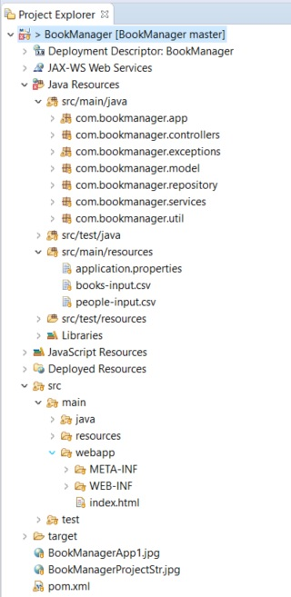

# BookManager

BookManager is a REST based web application built to handle the primary housekeeping functions of a library such as managing library members, books... etc. The application also help libraries keep track of the books and their checkouts, as well as members' subscriptions and profiles.


## Getting Started

These instructions will get you a copy of the project up and running on your local machine for development and testing purposes. See deployment for notes on how to deploy the project on a live system.

### Prerequisites

What things you need to install the software and how to install them

```
BookManager is a Maven project developed using Java 1.8, Latest JRE on a PC with a Internet Browser 
and a generated stand-alone application .jar are the Prerequisites to run this application.
```

### Project structure

Project structure on Eclipse:



### Installing

A step by step series of examples that tell you how to get a development env running

Clone the project:
```
Clone or download the project from <a href="https://github.com/Shylendra/BookManager">here</a>
```

Build the project using Maven:
```
Navigate to the Cloned project folder, run the maven command: 'mvn clean install' to generate a stand alone BookManager-0.0.1-SNAPSHOT.jar
```

## Running the application in stand-alone mode

Steps to run the automated tests for this system

Navigate to the project's target folder and run the stand-alone web application:
```
java -jar target/BookManager-0.0.1-SNAPSHOT.jar
```

Open the Web browser and access the application @ localhost:
```
http://localhost:9090
```

## Deployment

The maven build generates deployable jar/war which can be used to deploy on live system.

## Built With

* [Java 8](https://www.oracle.com/technetwork/java/javase/downloads/jdk8-downloads-2133151.html) - The programming language used
* [Maven](https://maven.apache.org/) - Dependency Management
* [JUnit](https://junit.org/junit5/) - Used for unit and automated tests
* [Spring Framework](https://spring.io) - Used to build stand-alone and production ready spring applications
* [Bootstrap](https://getbootstrap.com/) - Is a front-end framework used to develop responsive web applications faster and easier
* [Vue.js](https://vuejs.org/) - Used for modular and flexible development environment for Web/UI based applications


